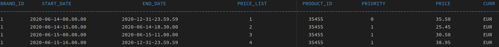

Esta es la solución a la prueba técnica para Inditex. A tener en cuenta a la hora de revisar el ejercicio:
- Se ha desarrollado siguiendo un "inside out approach" (se ha partido definiendo el dominio). Esto es debido a la naturaleza de la desambiguación. Es algo que se puede delegar en la base de datos, pero dado que no se especifica, se ha tratado como un problema de nuestro dominio y por lo tanto se resuelve dentro del mismo.
- Nuestro dominio no está acoplado a la capa JPA, posibilitándonos cambiar la forma en la que extraemos nuestras entradas de base de datos sin romperlo.
- La solución se ha implementado usando TDD, usando los 5 tests dados en el enunciado como la base para los casos de test finales, los de integración (+ casos de test que cubren el dominio y la capa de aplicación).
- Se sobreentiende que, dado el tamaño del proyecto, no es necesario una paquetería compleja. Se ha diseñado para lucir simple, eso no quita que en un proyecto mayor, las entidades estén separadas de los dtos, del controlador etc. Pero se ha respetado el KISS en la medida de lo posible.

Set up con el que se ha desarrollado:

    Maven: apache-maven-3.9.6
    Java: 17.0.11

Para probarla:

    mvn verify

Enunciado del ejercicio:

En la base de datos de comercio electrónico de la compañía disponemos de la tabla PRICES que refleja el precio final (pvp) y la tarifa que aplica a un producto de una cadena entre unas fechas determinadas. A continuación se muestra un ejemplo de la tabla con los campos relevantes:

PRICES
-------

Campos:

- BRAND_ID: foreign key de la cadena del grupo (1 = ZARA).
- START_DATE, END_DATE: rango de fechas en el que aplica el precio tarifa indicado.
- PRICE_LIST: Identificador de la tarifa de precios aplicable.
- PRODUCT_ID: Identificador código de producto.
- PRIORITY: Desambiguador de aplicación de precios. Si dos tarifas coinciden en un rago de fechas se aplica la de mayor prioridad (mayor valor numérico).
- PRICE: precio final de venta.
- CURR: iso de la moneda.

Se pide:

Construir una aplicación/servicio en SpringBoot que provea una end point rest de consulta  tal que:

Acepte como parámetros de entrada: fecha de aplicación, identificador de producto, identificador de cadena.
Devuelva como datos de salida: identificador de producto, identificador de cadena, tarifa a aplicar, fechas de aplicación y precio final a aplicar.

Se debe utilizar una base de datos en memoria (tipo h2) e inicializar con los datos del ejemplo, (se pueden cambiar el nombre de los campos y añadir otros nuevos si se quiere, elegir el tipo de dato que se considere adecuado para los mismos).

Desarrollar unos test al endpoint rest que  validen las siguientes peticiones al servicio con los datos del ejemplo:

-          Test 1: petición a las 10:00 del día 14 del producto 35455   para la brand 1 (ZARA)
-          Test 2: petición a las 16:00 del día 14 del producto 35455   para la brand 1 (ZARA)
-          Test 3: petición a las 21:00 del día 14 del producto 35455   para la brand 1 (ZARA)
-          Test 4: petición a las 10:00 del día 15 del producto 35455   para la brand 1 (ZARA)
-          Test 5: petición a las 21:00 del día 16 del producto 35455   para la brand 1 (ZARA)